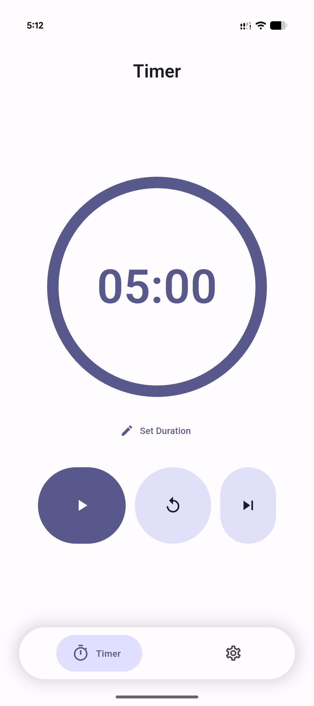
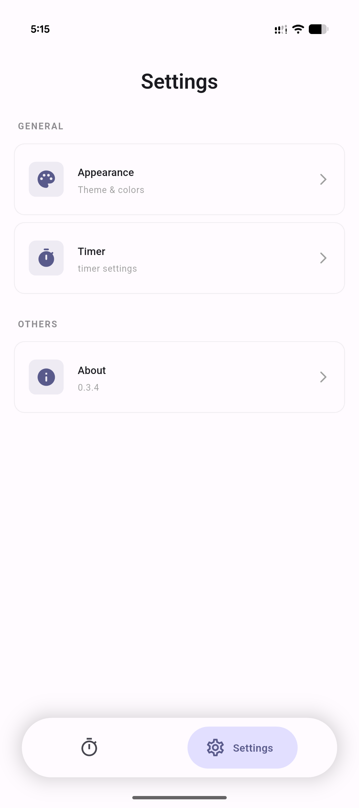
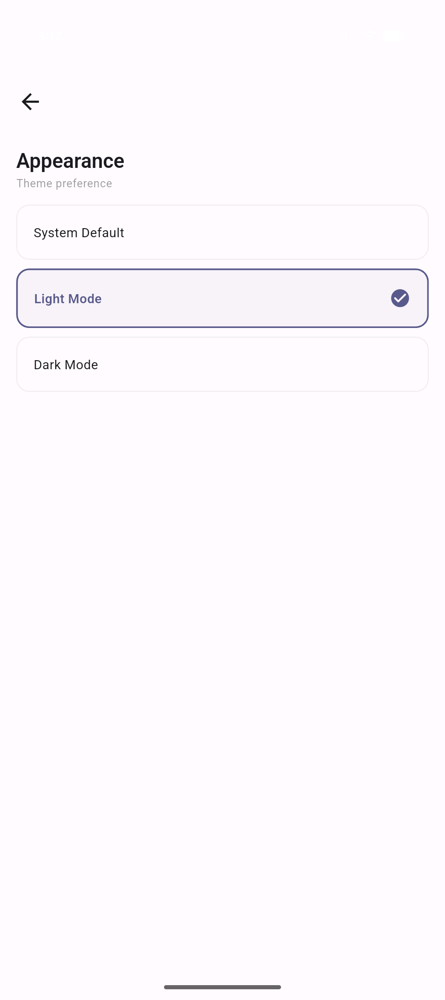

# Rakiz ⏱️

**Rakiz** is a minimal, clean, and smooth timer app built with the **Flutter** framework.  
It focuses on simplicity, performance, and a distraction-free experience.

---

## Philosophy

Rakiz was designed with one goal in mind:  
**to get the most out of Flutter’s performance, animations, and UI capabilities**.

By leveraging Flutter’s optimization and modern Material 3 design, Rakiz delivers a smooth, responsive, and visually clean experience while staying lightweight and functional.

---
## Screenshots

  
  
  

---

## Features

- **Minimal UI** based on **Material 3 (Expressive)**
- **Dynamic colors** that adapt to your device wallpaper
- **Timer**
  - Fully customizable duration
  - Reset at any time
  - Alarm notification when time ends
  - Smooth transition between **Focus → Break** modes
- **Minimal statistics** to help you stay on track without distractions

---

## Download

Rakiz is available on:
- 🌐 Official Rakiz website
- 📦 F-Droid
- 🐙 GitHub Releases

---

## Built With

- **Flutter**
- **Material 3**
